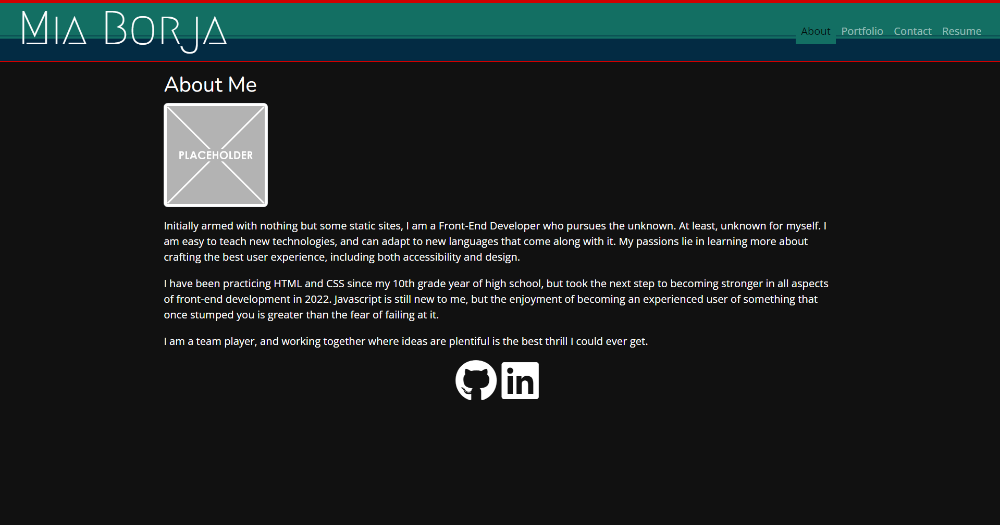
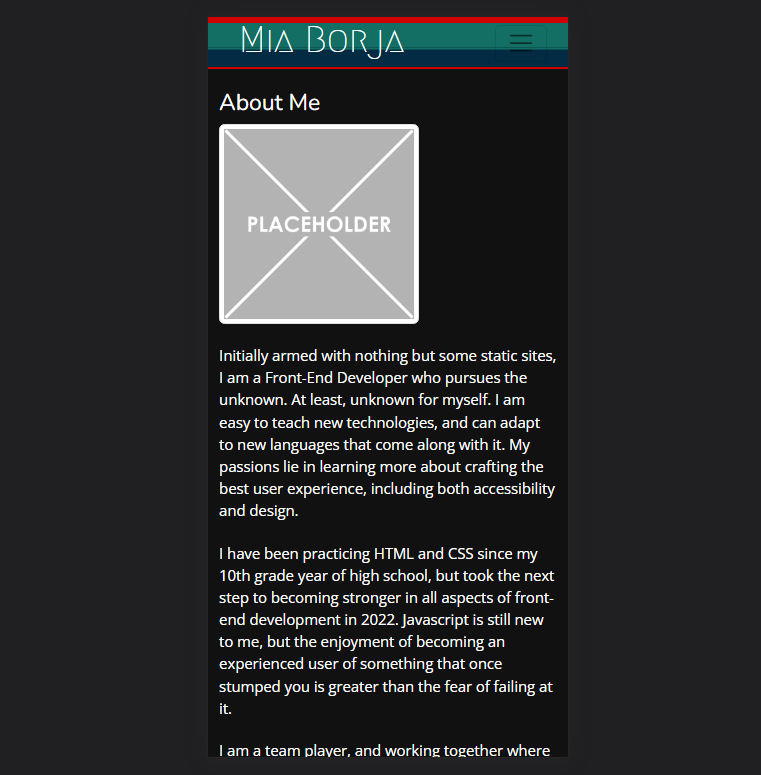

# React Portfolio

## Description

This is a portfolio that utilizes React to create a single-page application. The application relies on conditional rendering to detect status and state of the current page in order to render each individual component.

## Components

Aside from Bootstrap's prebuilt classes, this portfolio utilizes the React library Material UI for specific elements such as the error message presented on the contact form.

Each page is rendered through an individual JS page that is called within the Header component that connects the Nav to the main page.

## Errors

The dropdown menu for mobile is a work in progress and at the moment, the portfolio page does not render the projects correctly. The current work-arounds for these issues were to remove the drop-down mobile links for the time being until a fix is found, and to render each project without the .map function with the data.

## Usage

`npm i`

`npm start`

## Credits

* Material UI, which can be found at [mui.com/](https://mui.com/)
* [Graphic Placeholder](https://freesvg.org/graphic-placeholder) from FreeSVG
* [Tutorial](https://bobbyhadz.com/blog/react-on-hover-show-text) by Borislav Hadzhiev for having hover states

## Documentation

